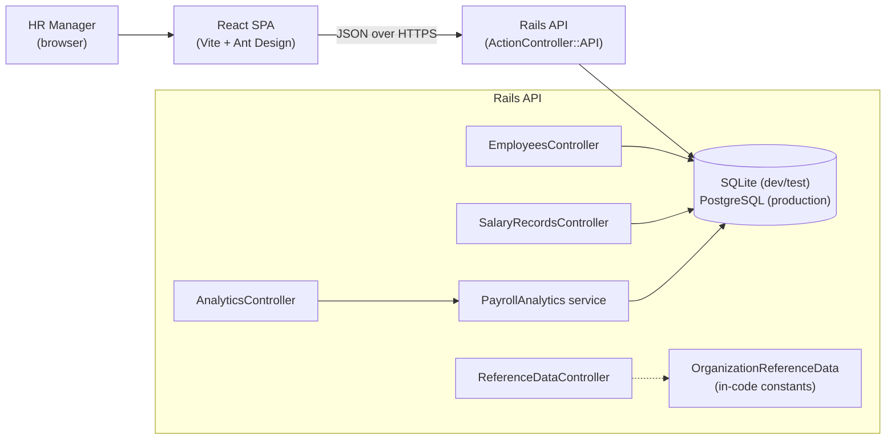
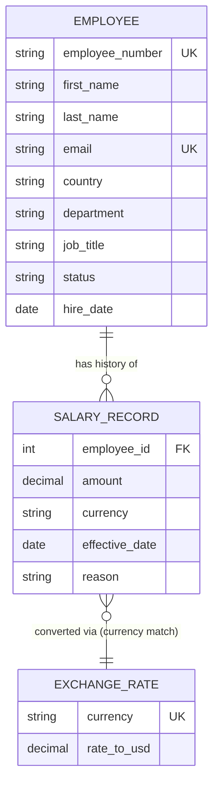
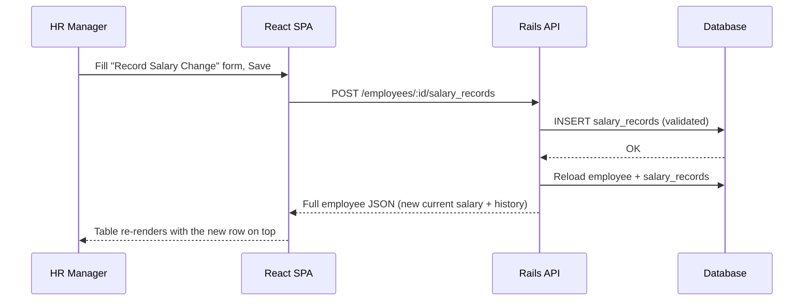

# Architecture

## System overview

The frontend never talks to the database directly — every read and write
goes through the Rails API as plain JSON. `PayrollAnalytics` is a separate
service object rather than logic inlined in `AnalyticsController` because
the aggregation query (see below) is the one piece of business logic
substantial enough to want its own unit tests independent of the HTTP layer.

## Data model

The deliberate choice here — covered in more depth in `trade-offs.md` — is
that `SALARY_RECORD` is a history, not a column on `EMPLOYEE`. An employee's
"current salary" is a derived read (latest `effective_date`, tie-broken by
`id`), not a stored fact, so a raise or correction is always an _addition_
to the record, never an overwrite. `EXCHANGE_RATE` isn't a foreign key
relationship in the schema (there's no `exchange_rate_id` column) — it's
joined at query time by matching `currency`, so adding a new supported
currency never requires backfilling existing salary records.

## Request flow: recording a raise

No employee attributes change when a raise is recorded — only a new
`SalaryRecord` row is inserted. This is the same "history over mutation"
principle applied at the request level.
